# Backend Interaction Flow

Here is the detailed flow of how the **Backend Node** interacts with the **Frontend**, **Python Service**, and **Scraper Node**.

## 🔄 Interaction Diagram

```mermaid
sequenceDiagram
    participant Frontend as 🖥️ Frontend (React)
    participant Backend as ⚙️ Backend (Node.js)
    participant Python as 🐍 Python ML Service
    participant DB as 🗄️ Database (MongoDB)
    participant Scraper as 🕷️ Scraper Node

    %% --------------------------------
    %% Flow 1: Media Upload by User
    %% --------------------------------
    rect rgb(20, 20, 20)
    note right of Frontend: 1. User Uploads Digital Asset
    Frontend->>Backend: POST /api/media/upload (File + Metadata)
    
    activate Backend
    Backend->>Python: POST /compare/image or /video (Send File)
    activate Python
    Python-->>Backend: Returns Fingerprint (pHash, Embeddings)
    deactivate Python
    
    Backend->>DB: Save Media + Fingerprint Profile
    DB-->>Backend: Success
    Backend-->>Frontend: 201 Created (Success & Data)
    deactivate Backend
    end

    %% --------------------------------
    %% Flow 2: Background Scraping & Reporting
    %% --------------------------------
    rect rgb(30, 30, 50)
    note left of Scraper: 2. Background Scraper Detects Piracy
    Scraper->>Python: Send Scraped Image for Comparison
    Python-->>Scraper: Returns Similarity Score
    
    opt If Similarity > Threshold (Piracy Detected)
        Scraper->>Backend: POST /api/media/report (Violation Details)
        activate Backend
        Backend->>DB: Save Violation (isViolation: true)
        DB-->>Backend: Success
        Backend-->>Scraper: 201 Created (Report Saved)
        deactivate Backend
    end
    end

    %% --------------------------------
    %% Flow 3: Viewing Results on Dashboard
    %% --------------------------------
    rect rgb(20, 50, 20)
    note right of Frontend: 3. Admin Views Dashboard
    Frontend->>Backend: GET /api/media/violations
    activate Backend
    Backend->>DB: Fetch media where isViolation=true
    DB-->>Backend: Violations List
    Backend-->>Frontend: 200 OK (Violations Data)
    deactivate Backend
    end
```

## 📝 Detailed Explanation (Backend Centric)

### 1. Frontend ↔ Backend (Client Interactions)
**Backend Role**: Expose REST APIs to handle client requests.
- **Upload (`POST /api/media/upload`)**: User uploads an original image/video. The backend receives the Multipart form data (`title`, `type`, `file`).
- **Fetch Media (`GET /api/media`)**: Frontend asks for all protected assets. Backend fetches them sorted by creation date from MongoDB.
- **Fetch Violations (`GET /api/media/violations`)**: Dashboard requests a list of all detected pirated matches.

### 2. Backend ↔ Python ML Service (Processing)
**Backend Role**: Orchestrator. It does not perform heavy Machine Learning tasks natively.
- When an asset is uploaded, the backend temporarily stores it via `multer` (storageService).
- It immediately sends this file to the Python Service (`POST /compare/image` or `/video`).
- The Python service executes heavy tasks (ResNet embeddings, pHash/dHash).
- Once the Python service responds with the structural and visual fingerprint data, the Backend attaches this to the MongoDB document (`mediaModel`) so the original profile is saved.

### 3. Backend ↔ Scraper Node (Reporting Engine)
**Backend Role**: Receiver of internal system alerts.
- The `scraper-node` runs independently in the background. It finds images online and asks the Python service to compare them with existing fingerprints.
- When the scraper finds a high similarity (piracy match), it acts as an internal client to the Backend.
- Scraper sends a request to the Backend's internal route (`POST /api/media/report`).
- The Backend receives the `similarityScore`, `sourceUrl` (where it was found), and `matchedWith` data, flags it (`isViolation: true`), and stores it in the database for the Frontend to later query.
