# Complete System Architecture Flow (DAPS)

This document provides a **Unified View** of the entire Digital Asset Protection System. It combines the roles of the **Frontend**, **Backend**, **Scraper**, and **Python ML Service** into a single cohesive workflow.

## 🌟 Unified Interaction Diagram

```mermaid
sequenceDiagram
    participant User as 👤 Admin / User
    participant Frontend as 🖥️ Frontend (React)
    participant Scraper as 🕷️ Scraper Node
    participant Backend as ⚙️ Backend API
    participant DB as 🗄️ Database (MongoDB)
    participant Python as 🐍 Python ML Service
    participant Web as 🌍 Target Websites

    %% --------------------------------
    %% Phase 1: Asset Protection (Upload)
    %% --------------------------------
    rect rgb(20, 20, 20)
    note right of User: Phase 1: Uploading Original Asset
    User->>Frontend: Chooses File & Uploads
    activate Frontend
    Frontend->>Backend: POST /api/media/upload (File)
    activate Backend
    
    Backend->>Python: POST /compare/image or /video
    activate Python
    Python-->>Backend: Returns AI Fingerprint (pHash, Embedding)
    deactivate Python
    
    Backend->>DB: Saves Media info + Fingerprint Profile
    DB-->>Backend: Insert Success
    Backend-->>Frontend: 201 Created
    deactivate Backend
    Frontend-->>User: Dashboard Updated
    deactivate Frontend
    end

    %% --------------------------------
    %% Phase 2: Automated Piracy Scanning
    %% --------------------------------
    rect rgb(30, 30, 50)
    note right of Scraper: Phase 2: Background Cron Detection
    Scraper->>Backend: GET /api/media (Fetch Reference Targets)
    Backend-->>Scraper: Returns Original Asset Profiles
    
    Scraper->>Web: Execute Web Scraping routine
    Web-->>Scraper: Download suspect images
    
    loop For Every Image Scraped
        Scraper->>Python: POST /compare (Scraped File + Target Fingerprint)
        activate Python
        Python-->>Scraper: Match Result (True/False) + Similarity %
        deactivate Python
        
        opt If similarity > threshold (Match)
            Scraper->>Backend: POST /api/media/report
            Backend->>DB: Save Violation Flag & Match URL
            Backend-->>Scraper: 201 Report Logged
        end
        Scraper->>Scraper: Delete Scraped Local File (Cleanup)
    end
    end

    %% --------------------------------
    %% Phase 3: Dashboard Review
    %% --------------------------------
    rect rgb(20, 50, 20)
    note right of User: Phase 3: Review Violations
    User->>Frontend: Clicks "Violations" page
    activate Frontend
    Frontend->>Backend: GET /api/media/violations
    Backend->>DB: Query { isViolation: true }
    DB-->>Backend: Returns Violations Array
    Backend-->>Frontend: JSON Response
    Frontend-->>User: Renders Red Alert Violation Cards
    deactivate Frontend
    end
```

---

## 📝 Detailed Module Breakdown

### 1. The Frontend (React UI)
**Goal:** Interface for humans.
- **Components Route:** User interacts with `<Dashboard />`, `<Upload />`, and `<Violations />`.
- **Connections:** Uses `axios` to make REST HTTP API calls strictly to the **Backend Node** (`/upload`, `/`, `/violations`).
- **Data Flow:** Entirely dependent on the JSON provided by the backend to render the DOM. Never contacts the Python ML or Database directly.

### 2. The Backend (Node.js/Express)
**Goal:** The Central Brain & Orchestrator.
- **Connections:** Talks to `Frontend` (serves data), `Database` (saves data), `Python ML Service` (delegates math processing), and [Scraper](file:///d:/Piracy_detection/digital-asset-protection/scraper-node/index.js#11-70) (listens to reports).
- **Core Loop:** 
  - Takes files from the Frontend via `multer`.
  - Sends them to Python for visual processing.
  - Takes the resulting "Fingerprints" and stores them in MongoDB so the scraper knows what to look for.

### 3. The Python ML Service (FastAPI)
**Goal:** Heavy mathematical and visual model execution.
- **Connections:** Fully disconnected from databases and frontends. It strictly takes API calls (Files + Parameters) from the **Backend** and **Scraper**.
- **Core Loop:**
  - `models/cnn_model.py`: Generates ResNet deep embeddings (Semantic structure).
  - [services/image_hash.py](file:///d:/Piracy_detection/digital-asset-protection/python-service/services/image_hash.py): Generates traditional pHash/dHash (Geometric duplication).
  - [similarity.py](file:///d:/Piracy_detection/digital-asset-protection/python-service/services/similarity.py): Checks Cosine Similarity (`>= 85%`) and Hamming Distances (`<= 10`) to explicitly verify if Image A matches Image B.

### 4. The Scraper Service (Node.js Background Jobs)
**Goal:** Autonomous patrol and investigation.
- **Connections:** Reaches out to the public `Web` (scrapes HTML/images), calls the `Python API` to verify downloaded images, and securely pushes reports to the internal `Backend API` endpoints.
- **Core Loop:**
  - Driven by `node-cron`, wakes up periodically.
  - Checks what assets need protecting (`GET` from backend).
  - Hunts for them on target sites.
  - Asks Python "Is this scraped image a match to our protected asset?"
  - If Yes 🚨 -> Reports it. If No -> Deletes it from its temporary drive. 

---

> **Summary Note:** The beauty of this microservice design is that the **Heavy Machine Learning (Python)** never blocks the **User Experience (Frontend/Backend)**, and the **Scraper (Patrol Node)** operates completely async without dragging down the main API's database.
