# Frontend Interaction Flow

Here is the detailed flow of how the **Frontend (React)** interacts with the user components and the **Backend API**.

## 🔄 Interaction Diagram

```mermaid
sequenceDiagram
    participant User as 👤 User / Admin
    participant App as ⚛️ React App (Router)
    participant Home as 🏠 Home Page
    participant Upload as 📤 Upload Component
    participant Violations as 🚨 Violations Page
    participant API as 🌐 API Service (axios)
    participant Backend as ⚙️ Node.js Backend

    %% --------------------------------
    %% Flow 1: App Navigation
    %% --------------------------------
    rect rgb(20, 20, 20)
    note right of User: Navigation
    User->>App: Opens App (/)
    App->>Home: Renders Home & Dashboard
    User->>App: Clicks "Violations"
    App->>Violations: Renders Violations Page
    end

    %% --------------------------------
    %% Flow 2: Uploading Media
    %% --------------------------------
    rect rgb(30, 30, 50)
    note left of Home: User Uploads Asset
    User->>Upload: Selects File & Submits
    activate Upload
    Upload->>API: uploadMedia(formData)
    activate API
    API->>Backend: POST /api/media/upload (multipart/form-data)
    Backend-->>API: 201 Created (Media Data)
    API-->>Upload: Returns Success
    deactivate API
    Upload-->>User: Shows Success Message & Updates Dashboard
    deactivate Upload
    end

    %% --------------------------------
    %% Flow 3: Fetching Data
    %% --------------------------------
    rect rgb(20, 50, 20)
    note right of User: Viewing Dashboard & Violations
    
    %% Dashboard Flow
    Home->>API: getMedia() on mount
    activate API
    API->>Backend: GET /api/media
    Backend-->>API: 200 OK (Protected Assets List)
    API-->>Home: Updates State (Assets)
    deactivate API
    
    %% Violations Flow
    Violations->>API: getViolations() on mount
    activate API
    API->>Backend: GET /api/media/violations
    Backend-->>API: 200 OK (Violations List)
    API-->>Violations: Updates State (Violations)
    deactivate API
    Violations-->>User: Renders Violation Cards
    end
```

## 📝 Detailed Explanation (Frontend Centric)

### 1. Application Structure ([App.jsx](file:///d:/Piracy_detection/digital-asset-protection/frontend/src/App.jsx))
**Frontend Role**: Handle routing and main layout.
- The app uses `react-router-dom` for navigation between two main views: `/` (Home/Dashboard) and `/violations`.
- The [Header](file:///d:/Piracy_detection/digital-asset-protection/frontend/src/App.jsx#6-22) provides persistent UI and navigation links.

### 2. API Service Layer ([services/api.js](file:///d:/Piracy_detection/digital-asset-protection/frontend/src/services/api.js))
**Frontend Role**: Centralized HTTP client using `axios`.
The frontend strictly communicates with the Node.js backend (default: `http://localhost:5000/api/media`). It defines three primary functions:
1. [uploadMedia(formData)](file:///d:/Piracy_detection/digital-asset-protection/backend-node/controllers/mediaController.js#5-44): Sends a `POST /upload` request with `'Content-Type': 'multipart/form-data'` required for file uploads.
2. [getMedia()](file:///d:/Piracy_detection/digital-asset-protection/backend-node/controllers/mediaController.js#45-55): Fetches the list of all protected assets (`GET /`).
3. [getViolations()](file:///d:/Piracy_detection/digital-asset-protection/frontend/src/services/api.js#23-27): Fetches the list of detected pirated content (`GET /violations`).

### 3. Page Level Interactions

#### **Home Page** ([pages/Home.jsx](file:///d:/Piracy_detection/digital-asset-protection/frontend/src/pages/Home.jsx))
- Composed of `<Dashboard />` and `<Upload />` components.
- `<Dashboard />` fetches and displays the currently protected assets by calling [getMedia()](file:///d:/Piracy_detection/digital-asset-protection/backend-node/controllers/mediaController.js#45-55).
- `<Upload />` provides a form for the user to upload new files, calling [uploadMedia()](file:///d:/Piracy_detection/digital-asset-protection/backend-node/controllers/mediaController.js#5-44).

#### **Violations Page** ([pages/Violations.jsx](file:///d:/Piracy_detection/digital-asset-protection/frontend/src/pages/Violations.jsx))
- When the page mounts (via `useEffect`), it triggers [fetchViolations()](file:///d:/Piracy_detection/digital-asset-protection/frontend/src/pages/Violations.jsx#10-20) which calls `api.getViolations()`.
- While fetching, it handles structural loading states.
- Once data is received, it maps over the violation data and renders individual `<ViolationCard />` components showing the similarity score and source URL where the piracy was detected.
- If there are no violations, it shows a clean "All clear!" success state.
