# Python ML Service Interaction Flow

Here is the detailed flow of how the **Python ML Service (FastAPI)** processes media structurally and visually to detect piracy.

## 🔄 Interaction Diagram

```mermaid
sequenceDiagram
    participant Clients as ⚙️ Backend / 🕷️ Scraper
    participant API as 🚀 FastAPI (Routes)
    participant ML_Models as 🧠 ML Models (CNN, OpenCV)
    participant Similarity as 📏 Similarity Engine
    
    %% --------------------------------
    %% Flow 1: Generate Fingerprint (No Target Provided)
    %% --------------------------------
    rect rgb(20, 20, 20)
    note right of Clients: Flow A: Upload Mode (Generate Profile)
    Clients->>API: POST /compare/image or /compare/video (File)
    activate API
    
    API->>ML_Models: Extract Hashes & Embeddings
    activate ML_Models
    ML_Models-->>API: Returns (pHash, dHash, Embedding / Video Fingerprint)
    deactivate ML_Models
    
    API-->>Clients: 200 OK (Returns Data dictionary)
    deactivate API
    end

    %% --------------------------------
    %% Flow 2: Compare with Target (Piracy Detection)
    %% --------------------------------
    rect rgb(30, 30, 50)
    note right of Clients: Flow B: Scraper Mode (Compare Profile)
    Clients->>API: POST /compare/image (File + target_phash + target_embedding)
    activate API
    
    API->>ML_Models: Extract Hashes & Embeddings for incoming file
    activate ML_Models
    ML_Models-->>API: Returns Incoming Data
    deactivate ML_Models
    
    API->>Similarity: Calculate Hamming Distance & Cosine Similarity
    activate Similarity
    Similarity-->>API: Returns (Distance, CosSim)
    deactivate Similarity
    
    opt If Match condition met
        note right of API: Is Cosine >= 0.85 OR Hamming <= 10?
        API-->>Clients: 200 OK (Match: True, Similarity Score)
    end
    opt If Not Match
        API-->>Clients: 200 OK (Match: False)
    end
    deactivate API
    end
```

## 📝 Detailed Explanation (Python ML Centric)

### 1. Router Layer ([routes/compare.py](file:///d:/Piracy_detection/digital-asset-protection/python-service/routes/compare.py))
**Role**: Exposes FastAPI endpoints for incoming files.
- **`/compare/image`**: Acts in two modes based on parameters:
  - **Generation Mode**: If only a file is sent, it returns `phash`, `dhash`, and a ResNet `embedding`.
  - **Comparison Mode**: If `target_phash` and `target_embedding` are included, it computes similarity.
- **`/compare/video`**: Extracts frames and generates a list of hashes. Compares against the `target_fingerprint` by finding the minimum distance across frame matches.

### 2. Machine Learning Generation
**Role**: Understand and map visual features into mathematical arrays.
- **Image Hashing ([services/image_hash.py](file:///d:/Piracy_detection/digital-asset-protection/python-service/services/image_hash.py))**: Uses the `imagehash` library to generate `pHash` (Perceptual Hash) and `dHash` (Difference Hash). This catches exact duplicates and resized images.
- **Deep Embeddings (`models/cnn_model.py`)**: Uses a Convolutional Neural Network (likely PyTorch/ResNet or equivalent) to generate a high-dimensional vector representing the *semantic meaning* of the image.

### 3. Similarity Engine ([services/similarity.py](file:///d:/Piracy_detection/digital-asset-protection/python-service/services/similarity.py))
**Role**: Decide if two math representations refer to the same visual asset.
- **Hamming Distance**: Counts the number of different bits between two hash strings. For images, a distance `<= 10` is considered a match. For videos, `<= 15`.
- **Cosine Similarity**: Measures the angle between two embedding vectors. A score `>= 0.85` (85%) means the images look structurally identical to the AI, even if crops or watermarks have ruined the simple hashes.

### 4. Temporary File Handling (`utils.helpers.ensure_dir`)
Because FastAPI streams multipart form data, the service temporarily saves incoming files to a local `/uploads` directory using a `uuid4()` name, passes the file path to the ML models, and strictly uses `os.remove(temp_filepath)` to clean up and prevent storage leaks.
