# Scraper Node Interaction Flow

Here is the detailed flow of how the **Scraper Node** operates independently in the background to detect piracy.

## 🔄 Interaction Diagram

```mermaid
sequenceDiagram
    participant Cron as ⏳ Cron Scheduler
    participant ScraperLogic as 🤖 Scraper Engine (index.js)
    participant Web as 🌍 Target Websites Let's say (imageScraper.js)
    participant Backend as ⚙️ Backend Node
    participant Python as 🐍 Python ML Service

    %% --------------------------------
    %% Flow 1: Initialization & Information Gathering
    %% --------------------------------
    rect rgb(20, 20, 20)
    Cron->>ScraperLogic: Triggers job every X minutes/hours
    activate ScraperLogic

    ScraperLogic->>Backend: GET /api/media
    activate Backend
    Backend-->>ScraperLogic: Returns Reference Media (Profiles + Metadata)
    deactivate Backend
    end

    %% --------------------------------
    %% Flow 2: Web Scraping & Comparison
    %% --------------------------------
    rect rgb(30, 30, 50)
    ScraperLogic->>Web: scrapeImages()
    Web-->>ScraperLogic: Downloads temporary images Locally

    loop For Every Scraped Image
        loop For Every Reference Profile
            ScraperLogic->>Python: POST /compare (Scraped File + Reference Profile)
            activate Python
            Python-->>ScraperLogic: Returns (Match: True/False, Similarity)
            deactivate Python
            
            opt If Match == True
                ScraperLogic->>Backend: POST /api/media/report (Violation details)
                Backend-->>ScraperLogic: 201 Report Saved
                note right of ScraperLogic: Break Inner Loop (Already Flagged)
            end
        end
        ScraperLogic->>ScraperLogic: Delete Scraped Image from Local Disk (fs.unlinkSync)
    end
    deactivate ScraperLogic
    end
```

## 📝 Detailed Explanation (Scraper Centric)

### 1. Autonomous Background Engine ([index.js](file:///d:/Piracy_detection/digital-asset-protection/scraper-node/index.js))
**Role**: Periodic automation without human intervention.
- The `node-cron` library sets a scheduler that runs a function [runScraper()](file:///d:/Piracy_detection/digital-asset-protection/scraper-node/index.js#11-70) on a set interval (e.g., `0 * * * *` for every hour).
- Can also be triggered manually using `node index.js --run-now`.

### 2. Information Gathering Phase
**Role**: Knowing what to look for.
- Before it starts web scraping, the node makes an HTTP `GET` request to the central **Backend Node** (`/api/media`).
- It filters the returned database entries to only keep those containing fingerprints (`phash`, `embeddings`) where `isViolation` is strictly `false`. (It ignores existing violations).

### 3. Scraping & Comparison Phase
**Role**: Downloading and verifying visual data.
- **Scraping**: `scrapeImages()` runs external logic (perhaps Puppeteer, Axios+Cheerio, or API based) to download potentially pirated images to the local disk.
- **Nested Loop**: 
  - For every single image downloaded from the web...
  - It iterates over *all* the protected assets stored in the database.
- **Verification**: It sends the *physical downloaded file* along with the *Database Reference Profile* directly to the **Python ML Service** via `sendForComparison()`.
- The ML Service does the heavy lifting, comparing the math.

### 4. Violation Reporting & Memory Management
**Role**: Acting on intelligence and staying lightweight.
- If the Python API responds with `match: true`, the Scraper immediately alerts the **Backend Node** using `POST /api/media/report`, including the similarity score, source URL, and original media `_id`.
- The inner loop breaks (no need to check this image against other protected assets if it's already caught as piracy).
- Lastly, the system calls `fs.unlinkSync()` to delete the scraped image off its hard drive, ensuring the server doesn't run out of memory.
